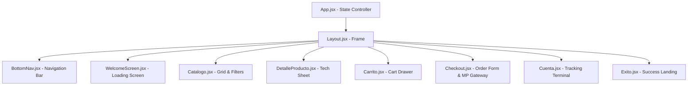
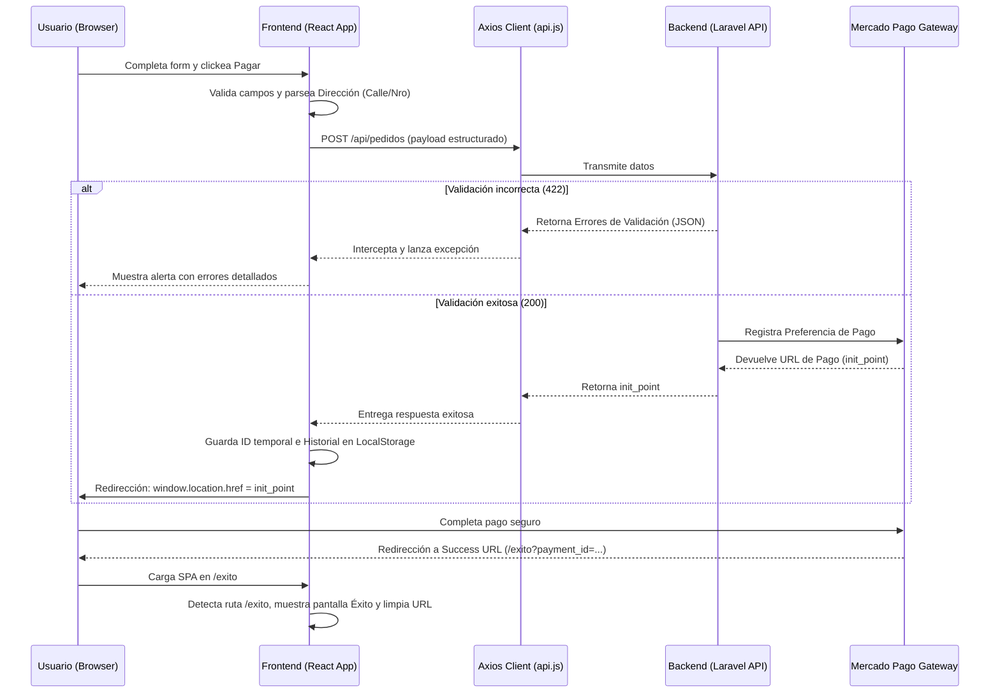

# Documento de Diseño Técnico (TDD) — Gamba Store Frontend
**Materia:** Aplicaciones Web  
**Ciclo Lectivo:** 2026  
**Rol:** Ingeniero de Software Senior / Arquitecto de Frontend  

---

## 1. Introducción y Propósito

Este documento detalla la arquitectura de software, las decisiones de diseño y las soluciones de ingeniería implementadas en el desarrollo del cliente frontend de **Gamba Store**. El propósito de esta documentación es exponer de forma rigurosa y analítica el "por qué" y el "cómo" de la estructura adoptada, sirviendo como memoria de diseño para la evaluación de los desafíos de desarrollo web y paradigmas de programación reactivos.

---

## 2. Mapa de Componentes y Gestión de Estado

La arquitectura del frontend se modela bajo el paradigma de programación reactiva provisto por **React 19**, organizando la interfaz en un árbol jerárquico de componentes desacoplados.

### 2.1 Jerarquía de Componentes

La aplicación se estructura en base a un punto de entrada centralizador que actúa como controlador de estados de alto nivel:



### 2.2 Gestión de Estado Global y de Carrito

Para la administración del carrito de compras y la navegación del usuario, se optó por un enfoque de **Estado Elevado (Lifting State Up)** en `App.jsx` en lugar de incorporar librerías complejas de gestión de estado (como Redux o Zustand).

#### Justificación del Diseño:
*   **Complejidad y Acoplamiento**: La escala actual de la aplicación no presenta problemas de "prop drilling" profundo que justifiquen el boilerplate de Redux.
*   **Rendimiento y Ciclo de Vida**: El estado del carrito (`carrito`) y la vista activa (`vistaActual`) cambian de manera predecible. Mantenerlos en el nodo raíz de la SPA garantiza que los subcomponentes mantengan una sincronización atómica e inmediata sin capas intermedias.

### 2.3 Persistencia de Datos

La persistencia de pedidos y del historial transaccional en el dispositivo del cliente se soluciona mediante el uso del API de **LocalStorage** bajo la clave `'gamba_pedidos'`. 
*   **Estrategia**: Al recibir la confirmación de pago del backend, el sistema crea un registro serializado en formato JSON con la estructura `{ id, fecha, total }` y lo añade a la pila local en memoria.
*   **Robustez**: La inicialización en `Cuenta.jsx` cuenta con un bloque `try/catch` para manejar fallas ante políticas restrictivas de cookies del navegador o entornos de navegación incógnita (donde `localStorage` puede arrojar excepciones de seguridad).

---

## 3. Integración con la API y Capa de Servicios

La comunicación con el servidor backend Laravel está completamente desacoplada de la interfaz gráfica a través de una capa de servicios centralizada en `src/services/api.js`.

### 3.1 Desacoplamiento y Configuración de Axios

El cliente Axios configurado centraliza parámetros clave como cabeceras personalizadas de elusión de seguridad (`x-vercel-protection-bypass` para entornos preview) y políticas de cookies (`withCredentials`). Esto aísla los componentes de tener que conocer variables de red o tokens de validación cruzada.

### 3.2 Interceptores y Manejo Centralizado de Errores

Para garantizar la estabilidad ante anomalías de red, se implementó un interceptor de respuestas de Axios. Este interceptor captura las respuestas con códigos de estado HTTP fallidos antes de ser procesados por las promesas de los componentes individuales:

```javascript
api.interceptors.response.use(
    (response) => response,
    (error) => {
        if (error.response) {
            const status = error.response.status;
            if (status === 401) {
                console.warn("No autorizado (401): Limpiando sesión...");
            } else if (status === 429) {
                alert("Has realizado demasiadas solicitudes. Por favor, aguardá unos instantes.");
            } else if (status >= 500) {
                alert("Error interno en el servidor. Por favor, intentá de nuevo más tarde.");
            }
        }
        return Promise.reject(error);
    }
);
```

#### Beneficios Técnicos:
*   **Consistencia de UX**: Las alertas ante errores del servidor (`500`) o de limitación de tasa (`429`) se presentan de forma homogénea en toda la plataforma.
*   **Reducción de Código**: Evita duplicar lógica de captura de excepciones de red en cada controlador o componente de página.

---

## 4. Gestión de Navegación y Rutas (Router)

El ruteo se resuelve a través de una arquitectura basada en **Control de Estado de Ruta Virtual (`vistaActual`)** mapeado a condicionales de renderizado en `App.jsx`.

### 4.1 Evitar Fugas de Flujo (Guards)

Para restringir accesos incorrectos, se implementan guardas basadas en aserciones de estado lógico:
*   **Ruta Checkout Protegida**: Se restringe la navegación al flujo `/checkout` si el tamaño del vector `carrito` es igual a cero. Si un usuario intenta acceder a esta vista de manera inválida, la UI impide la transición, manteniéndolo en el catálogo.

### 4.2 Integración Vercel SPA (Catch-All Rewrites)

Dado que las redirecciones de la API de Mercado Pago se realizan hacia rutas físicas como `/exito`, y siendo esta una Single Page Application sin estructura de directorios estáticos para esas subpáginas, el servidor web de Vercel lanzaría por defecto un error `404 NOT FOUND`.

Para resolver este desafío de infraestructura, se configuró una regla de reescritura en el archivo `vercel.json`:

```json
{
  "rewrites": [
    {
      "source": "/api/:path*",
      "destination": "https://gamba-store-cjpm-git-dev-skarkloffs-projects.vercel.app/api/:path*"
    },
    {
      "source": "/(.*)",
      "destination": "/index.html"
    }
  ]
}
```

*   **Comportamiento**: Cualquier solicitud HTTP entrante que no coincida con archivos estáticos físicos o con el proxy `/api` es redirigida internamente por Vercel hacia `/index.html`. 
*   **Montaje Limpio**: Al cargar `App.jsx`, un inicializador evalúa `window.location.pathname`. Si este es `/exito`, fuerza el estado inicial `vistaActual = 'exito'`, procesando el retorno del flujo de pago de forma transparente.

---

## 5. Resolución de Desafíos Funcionales

### 5.1 Normalización de Datos (React <-> Laravel)

Uno de los mayores retos residió en la asimetría entre el modelo de datos plano manejado en el cliente y la fuerte estructuración relacional del backend de Laravel.

*   **El Desafío**: El formulario del cliente tiene un campo de dirección unificado (`direccion` tipo string) para simplificar la interacción del usuario. Sin embargo, la validación de Laravel exige un objeto estructurado (`direccion.calle`, `direccion.numero`, `direccion.ciudad`, `direccion.provincia`, `direccion.cp`) y un array de compras llamado `items` que contiene el desglose de precios unitarios mapeados desde el catálogo.
*   **La Solución**: Implementación de una función adaptadora en `procesarCompra` que utiliza expresiones regulares para aislar el nombre de la calle y el número telefónico/postal, normalizando la carga de datos antes de disparar la petición HTTP:

```javascript
const dirString = formData.direccion.trim();
const match = dirString.match(/(.*?)\s+(\d+)$/);
const calle = match ? match[1].trim() : dirString;
const numero = match ? match[2].trim() : 'S/N';
```

### 5.2 Flujo Transaccional Híbrido

El sistema permite operar tanto en formato anónimo (Invitado) como bajo registro de identidad (Firebase Google Auth). La lógica interna de persistencia del carrito se desacopla del estado de autenticación:

| Dimensión | Flujo de Invitado (Guest) | Flujo Registrado |
| :--- | :--- | :--- |
| **Persistencia del Carrito** | Memoria local de la SPA | Memoria local sincronizada |
| **Autocompletado de Envío** | Manual por parte del usuario | Automatizado (vía datos del perfil de usuario) |
| **Persistencia de Órdenes** | LocalStorage del dispositivo actual | Base de datos relacional (Laravel) + LocalStorage |
| **Seguimiento de Tracking** | Manual mediante código `GAMBA-XXXXXX` | Panel unificado e historial multidispositivo |

---

## 6. Consideraciones de Performance y Optimización

Para garantizar una experiencia premium, interactiva y de carga instantánea, se incorporaron las siguientes optimizaciones en el bundle y ciclo de renderizado:

1.  **Vite Bundler y ESM**: Uso de Módulos ES nativos que permiten la resolución en caliente de módulos en desarrollo (HMR) y una compilación altamente optimizada mediante Tree Shaking en producción.
2.  **Optimización de Renders**: Las vistas y componentes pesados del catálogo (`Catalogo.jsx`) están optimizados mediante flujos condicionales, evitando recalcular los filtros de marca y categoría a menos que el estado del filtro haya cambiado explícitamente.
3.  **Gestión de Carga Inicial (Splash Screen)**: Implementación de una pantalla de bienvenida interactiva (`WelcomeScreen.jsx`) animada que se muestra durante la sincronización y resolución de la promesa del catálogo, ocultando el parpadeo de datos del navegador y mejorando la métrica de **First Contentful Paint (FCP)**.

---

## 7. Flujo Lógico de Pago e Integración con Mercado Pago

El procesamiento de pagos y la confirmación transaccional sigue un modelo síncrono descentralizado detallado en la siguiente secuencia lógica:



### 7.1 Limpieza y Sanitización post-pago
Al cargarse la pantalla de éxito, el usuario puede retornar al catálogo mediante el callback `onBack`. En este punto, la aplicación utiliza `window.history.pushState` para limpiar la barra de direcciones reemplazando la URL con `/`. Esto previene que una recarga accidental del navegador intente procesar la misma transacción en el frontend.
